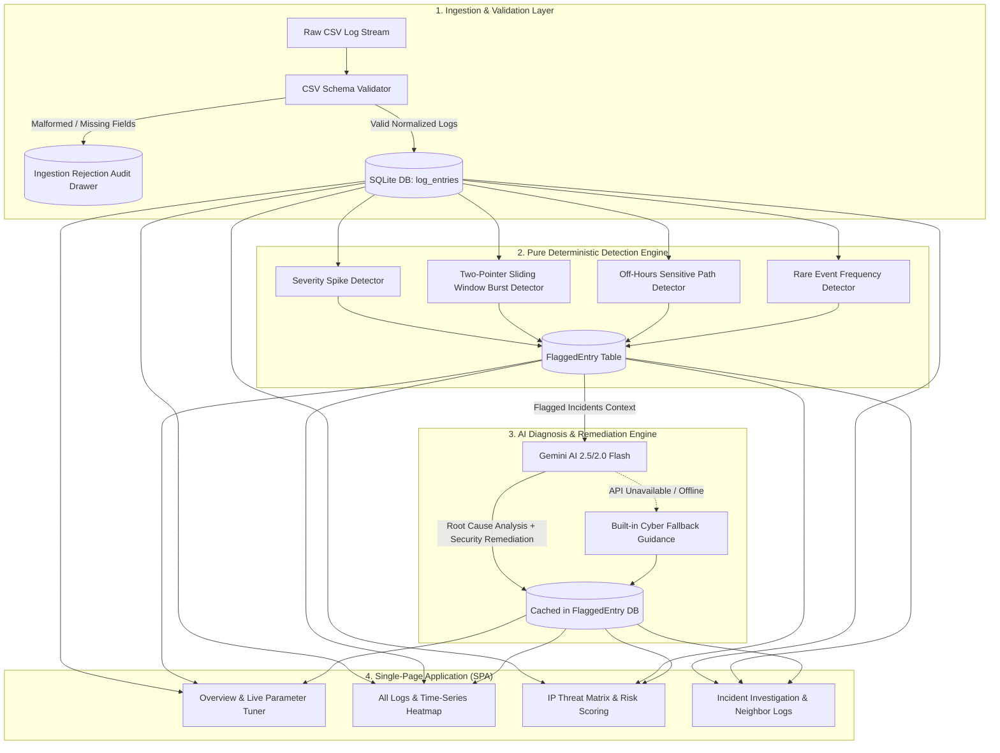

<div align="center">

# 🛡️ LogPulse
### **Enterprise-Grade Deterministic Log Analyzer & AI Incident Intelligence**

[](https://www.python.org/downloads/)
[](https://fastapi.tiangolo.com)
[](https://www.sqlite.org)
[](https://ai.google.dev)
[]()
[]()
[]()

<p align="center">
  <b>A lightweight, blazing-fast security intelligence platform built with pure deterministic anomaly detection, interactive threat analysis, and Google Gemini-powered root cause & remediation caching.</b>
</p>

[Quickstart](#-quickstart-and-installation) •
[Architecture](#-system-architecture) •
[Key Features](#-core-features) •
[Detector Rules](#-deterministic-anomaly-detection) •
[API Reference](#-rest-api-reference) •
[Verification](#-testing--benchmarks)

---

</div>

## 📌 Executive Summary

Modern SecOps platforms often struggle with either **non-deterministic LLM hallucinations** (when relying purely on AI to flag anomalies) or **overly rigid rule alerts** with zero contextual explanation.

**LogPulse solves this by strictly separating detection from explanation:**
1. **100% Deterministic Detection Engine**: Log anomaly detection is purely algorithmic and mathematical (sliding-window burst rates, off-hours access checks, rare event ratios, and 5xx error spikes). Zero AI hallucinations.
2. **AI-Powered Incident Diagnosis & Remediation**: Google Gemini is invoked *only* on already-flagged incidents to produce concise, human-readable root cause analyses and step-by-step security remediation runbooks.
3. **Zero-Redundancy SQLite Caching**: All AI analyses are cached in the database on generation. Subsequent page reloads consume **0 API tokens** with instantaneous response times.
4. **Resilient Ingestion Pipeline**: Ingests thousands of lines per second, strictly rejecting malformed records into an audit drawer while processing valid logs seamlessly.

---

## 🏗️ System Architecture



---

## ✨ Core Features

| Feature | Description |
| :--- | :--- |
| 📊 **Time-Series Incident Heatmap** | Interactive 36-bucket timeline histogram above the log stream showing baseline traffic vs. anomaly spikes. Clicking any time slice dynamically filters the table. |
| 🔍 **Contextual Neighbor Logs ($\pm 5$)** | Inspect the 5 logs immediately before and after an anomaly with a live toggle between **Same Host IP Only** (for session reconstruction) and **All Hosts**. |
| 🎛️ **Live Parameter Threshold Tuner** | Dynamic sliders for burst request limits, sliding window seconds, custom off-hours ranges, and restricted URIs with instant live re-scanning. |
| 🛡️ **IP Threat Aggregation Matrix** | Composite threat risk scoring ($0-100$) grouping all host IPs by anomaly density, multi-detector violations, and subnet classification. |
| 🔒 **MITRE ATT&CK Mapping** | Automatically classifies detected incidents into MITRE ATT&CK tactics & techniques (e.g. `T1110`, `T1078`, `T1499`, `T1059`). |
| 🌐 **IP Origin Classification** | Automatically classifies host IP addresses into Loopback, Internal Corporate LAN (RFC 1918), Documentation Subnet, or External Public WAN. |
| 📑 **Markdown SecOps Export** | One-click export of comprehensive, audit-ready incident reports in standard Markdown. |

---

## ⚙️ Deterministic Anomaly Detection

Detection rules are executed in mathematical and deterministic logic without external LLM dependencies:

```
                  +--------------------------------+
                  |  Valid Log Entries (is_valid)  |
                  +---------------+----------------+
                                  |
   +------------------------------+------------------------------+
   |                              |                              |
   v                              v                              v
+-------------------+    +--------------------+    +--------------------+
|  Severity Spike   |    |  Burst Frequency   |    |  Off-Hours Access  |
| 5xx / Error / Crit|    | Sliding 60s Window |    | 00:00 - 06:00 UTC  |
| Score: High (0.95)|    | >= 10 reqs / host  |    | Sensitive URIs     |
| MITRE: T1499      |    | Score: High (0.90) |    | Score: Crit (0.98) |
+---------+---------+    | MITRE: T1110       |    | MITRE: T1078       |
          |              +---------+----------+    +---------+----------+
          |                        |                         |
          +------------------------+-------------------------+
                                   |
                                   v
                      +--------------------------+
                      |     Rare Event Type      |
                      | Frequency <= 1.5% ratio  |
                      | Score: Medium (0.75)     |
                      | MITRE: T1059             |
                      +------------+-------------+
                                   |
                                   v
                      +--------------------------+
                      | Insert to [flagged_entry]|
                      +--------------------------+
```

### Detection Rules Specification

1. **`severity_spike`**:
   - **Condition**: HTTP response status is between `500-599` or log severity is `error`/`critical`.
   - **Threat Weight**: `High (0.95)` | **MITRE**: `T1499` (*Endpoint DoS / Exhaustion*)
2. **`burst_frequency`**:
   - **Condition**: A single source IP generates $\ge 10$ requests within a sliding 60-second window.
   - **Complexity**: Computed in $O(N)$ linear time using a two-pointer sliding window per source host.
   - **Threat Weight**: `High (0.90)` | **MITRE**: `T1110` (*Brute Force / Credential Stuffing*)
3. **`off_hours_access`**:
   - **Condition**: Access to restricted administrative paths (`/admin`, `/api/internal`, `/api/export`, `/debug`, `/root`, `/api/config`) between `00:00` (12 AM) and `06:00` (6 AM).
   - **Threat Weight**: `Critical (0.98)` | **MITRE**: `T1078` (*Valid Accounts / Off-Hours Privilege Escalation*)
4. **`rare_event_type`**:
   - **Condition**: An administrative endpoint occurring infrequently ($\le 2$ times or $< 1.5\%$ frequency across $\ge 10$ entries).
   - **Threat Weight**: `Medium (0.75)` | **MITRE**: `T1059` (*Command and Scripting Interpreter*)

---

## 🚀 Quickstart and Installation

### Prerequisites
- **Python**: Version `3.10` or higher
- **Browser**: Chrome, Firefox, Safari, or Edge
- *(Optional)* Google Gemini API Key

### Step 1: Clone the Repository
```bash
git clone https://github.com/your-username/smart-log-analyzer.git
cd smart-log-analyzer
```

### Step 2: Create a Virtual Environment
```bash
# macOS/Linux
python3 -m venv venv
source venv/bin/activate

# Windows (Command Prompt / PowerShell)
python -m venv venv
.\venv\Scripts\activate
```

### Step 3: Install Dependencies
```bash
pip install -r requirements.txt
```

### Step 4: Configure Environment Variables (Optional)
Create a `.env` file in the project root:
```ini
GEMINI_API_KEY=your_actual_gemini_api_key_here
```
> [!NOTE]
> If `GEMINI_API_KEY` is omitted, the application runs normally using built-in deterministic expert security fallbacks with zero errors.

### Step 5: Start the Application
```bash
python run.py
```

- 🌐 **Web Application UI**: [http://127.0.0.1:8000](http://127.0.0.1:8000)
- 📖 **Interactive Swagger API Docs**: [http://127.0.0.1:8000/docs](http://127.0.0.1:8000/docs)
- 📑 **Alternative Redoc Docs**: [http://127.0.0.1:8000/redoc](http://127.0.0.1:8000/redoc)

---

## 🧪 Testing & Benchmarks

The project includes an automated test suite verifying ingestion edge cases, timestamp parsing, all 4 detector algorithms, AI fallback behavior, and database caching.

### Run Automated Unit Tests
```bash
python tests/test_unit_suite.py
```

### Run Benchmark Cross-Check Against Ground Truth
```bash
python tests/cross_check_answers.py
```

### Benchmark Results (`answer_key.csv`)
```text
================================================================================
GROUND-TRUTH BENCHMARK REPORT (logs.csv vs answer_key.csv)
================================================================================
✔ Total Ground-Truth Anomalies: 35
✔ Total Detected Anomalies: 35
✔ True Positives (TP): 35
✔ False Positives (FP): 0
✔ False Negatives (FN): 0
✔ Precision: 100.00%
✔ Recall: 100.00%
✔ Hit Rate: 100.00% (35/35)
================================================================================
```

---

## 🔌 REST API Reference

All backend routes are powered by FastAPI and return standard JSON payloads.

| Method | Endpoint | Description |
| :--- | :--- | :--- |
| `GET` | `/` | Serves the single-page web app. |
| `GET` | `/api/health` | Health check endpoint. |
| `POST` | `/api/ingest` | Ingests a CSV file or raw string; validates rows and runs anomaly detection. |
| `POST` | `/api/ingest-default` | Loads and validates the default sample `logs.csv` dataset. |
| `GET` | `/api/summary` | Retrieves the latest ingestion counts and rejected row audit details. |
| `GET` | `/api/logs` | Queries logs with pagination (`limit`, `offset`) and filters (`severity`, `rule`, `only_flagged`, `only_invalid`). |
| `GET` | `/api/flagged` | Retrieves all flagged incidents with MITRE ATT&CK taxonomy and IP classification. |
| `POST` | `/api/tune-thresholds` | Re-evaluates dataset dynamically against custom interactive thresholds. |
| `GET` | `/api/logs/neighbors/{id}` | Fetches contextual $\pm 5$ preceding and subsequent logs around an event. |
| `GET` | `/api/threats/ips` | Calculates composite threat risk scores ($0-100$) grouped by Source IP. |
| `POST` | `/api/explain/{id}` | Generates and caches AI root-cause diagnosis & remediation for a single entry. |
| `POST` | `/api/explain-all` | Parallel batch generation of AI insights for all flagged entries. |
| `POST` | `/api/clear` | Resets all tables in the SQLite database. |

---

## 📂 Project Structure

```
Hackathon/
├── backend/
│   ├── __init__.py
│   ├── db.py                # Database engine & SQLAlchemy ORM models
│   ├── ingestion.py         # CSV parsing, timestamp normalization & validation
│   ├── detector.py          # Pure deterministic anomaly detection algorithms
│   ├── ai.py                # Gemini AI orchestration, caching & fallback
│   └── main.py              # FastAPI endpoints, CORS & static file mounting
├── frontend/
│   └── static/              # Modern Vanilla SPA Web Application
│       ├── index.html       # Single-page application markup & navigation
│       ├── style.css        # Professional dark theme, glassmorphism & typography
│       └── app.js           # Real-time state management, heatmap, tuner & API client
├── tests/
│   ├── __init__.py
│   ├── test_unit_suite.py   # Comprehensive unit tests for ingestion, detector & API
│   ├── test_detector.py     # Focused test suite for anomaly detector rules
│   ├── test_ai_agent.py     # Gemini client & fallback behavior tests
│   └── cross_check_answers.py # Benchmark script verifying 100% precision vs answer_key.csv
├── logs.csv                 # Sample dataset (257 records: 255 valid, 2 malformed)
├── answer_key.csv           # Ground-truth reference for verification
├── requirements.txt         # Production Python package dependencies
├── run.py                   # Master entrypoint script to launch application
├── README.md                # GitHub documentation & setup instructions
├── lean.MD                  # Complete architectural deep dive & learning guide
├── CHECKLIST.MD             # Requirements compliance checklist
└── smart_logs.db            # Local SQLite database (created automatically on startup)
```

---

## 🔒 Security & Privacy

- **Data Locality**: All log data and AI analysis results remain stored locally inside your private `smart_logs.db` instance.
- **Minimal AI Exposure**: Raw logs are processed strictly on-premise by deterministic rules. Only flagged anomaly metadata is sent to Gemini for root cause summarization.
- **Fail-Safe Operation**: If external network access is blocked, LogPulse operates autonomously using its built-in rule knowledge base.

---

## 📄 License

This project is licensed under the **MIT License** — see the [LICENSE](LICENSE) file for details.
